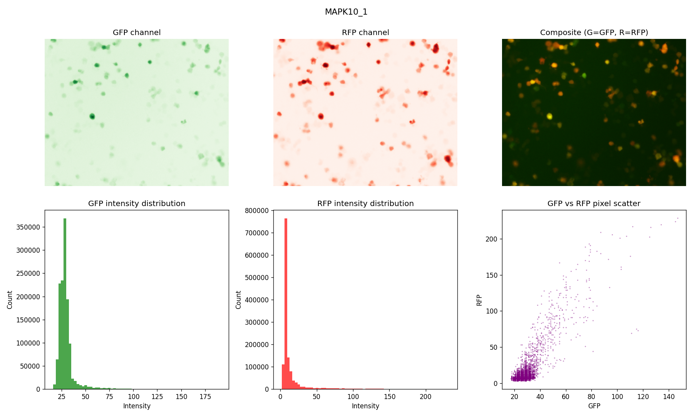
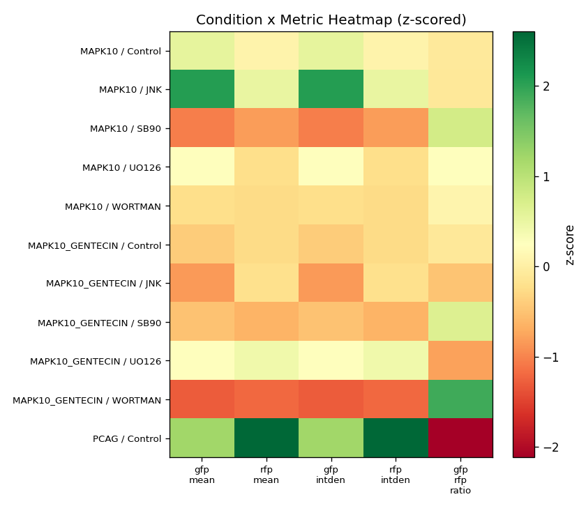
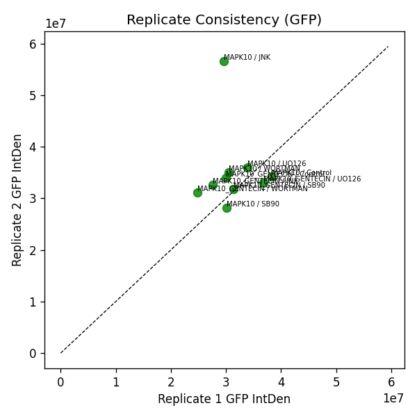

# Imagin_v2 — Fluorescence Image Quantification Tool

A Python-based desktop application that quantifies fluorescence microscopy images from `.tif` files. Replicates ImageJ's **Integrated Density (IntDen)** metric and automates the full pipeline — from raw image loading to statistical output — wrapped in a clean GUI.

---

## What It Does

- Loads multi-channel `.tif` fluorescence images (GFP, RFP, DAPI, CY5, mCherry, and more)
- Segments foreground (cells) from background using **Otsu's thresholding**
- Computes **Corrected Total Cell Fluorescence (CTCF)** — the ImageJ-standard background-subtracted IntDen
- Calculates pairwise channel ratios (e.g. GFP/RFP)
- Groups wells by condition and inhibitor, averages replicates, and exports results
- Generates publication-ready plots and a results CSV
- Runs as a standalone `.exe` — no Python installation needed

---

## Screenshots

| Channel Analysis | Condition Heatmap | Replicate Consistency |
|---|---|---|
|  |  |  |

---

## Installation

### Run from source

```bash
git clone https://github.com/bibekbiswa1090/Imagin_v2.git
cd Imagin_v2
pip install -r requirements.txt
python app.py
```

### Run as standalone executable

Download `FluorescenceAnalysis.exe` from the `dist/` folder and run it directly — no Python required.

---

## File Naming Convention

All `.tif` files must follow this pattern:

```
<WellName>_<CHANNEL>[_<replicate>].tif
```

**Recognised channel tags:** `GFP`, `RFP`, `DAPI`, `CY5`, `MCHERRY`, `YFP`, `CFP`, `TRITC`, `FITC`, `A488`, `A555`, `A647`, `TXR`

**Recognised inhibitor keywords:** `WORTMAN`, `UO126`, `SB90`, `JNK`

**Examples:**
```
MAPK10_GFP_1.tif                  → well: MAPK10, channel: GFP, replicate 1
MAPK10_GFP_2.tif                  → same well, replicate 2 (averaged with rep 1)
MAPK10_RFP_1.tif                  → second channel for the same well
MAPK10_JNK_GFP_1.tif             → inhibitor: JNK, channel: GFP
MAPK10_GENTECIN_UO126_RFP_1.tif  → treatment: MAPK10_GENTECIN, inhibitor: UO126
```

---

## Outputs

| File | Description |
|---|---|
| `fluorescence_results.csv` | Per-well Mean, IntDen, background mean, threshold, and all pairwise ratios |
| `condition_summary.csv` | Mean ± SD per condition group |
| `<WellName>_analysis.png` | Channel images, Otsu masks, histograms, pairwise scatter |
| `summary_intden.png` | All channels side-by-side per well |
| `condition_heatmap.png` | Z-scored heatmap across all metrics and conditions |
| `replicate_consistency.png` | Rep1 vs Rep2 scatter to assess reproducibility |
| `inhibitor_comparison_<group>.png` | Inhibitor effect comparison per treatment group |

---

## Libraries Used

| Library | Purpose |
|---|---|
| `tifffile` | Reading 8-bit / 16-bit / multi-channel TIFF microscopy files |
| `scikit-image` | Otsu thresholding for foreground/background segmentation |
| `numpy` | Pixel-level arithmetic, mask operations, CTCF calculation |
| `pandas` | Structuring per-well results and exporting CSV |
| `matplotlib` | Generating all output plots |
| `Pillow` | Image rendering in the GUI gallery |
| `tkinter` | Desktop GUI with threaded analysis runner |
| `PyInstaller` | Packaging into a standalone `.exe` |

---

## How It Works

1. Files are grouped by well name and channel tag using regex parsing
2. Each image is loaded and converted to a float array
3. **Otsu's method** computes a dynamic threshold per image to separate cells from background
4. **CTCF** is calculated as:
   ```
   IntDen = sum(foreground pixels) − background_mean × foreground_area
   ```
5. Replicates are averaged; pairwise channel ratios are computed
6. Results are exported as CSV and visualised as PNG plots

---

## Learnings

- Learned how microscopy TIFF files are structured (8-bit, 16-bit, RGB stacks) and how to handle them programmatically
- Understood Otsu's thresholding mathematically — minimising intra-class variance to find the optimal segmentation threshold dynamically per image
- Implemented the CTCF/IntDen formula correctly with background subtraction, making fluorescence values biologically interpretable
- Built a responsive multi-threaded Tkinter GUI that keeps the UI live during long analysis runs
- Packaged a full Python scientific stack into a portable `.exe` using PyInstaller

The most satisfying moment was when the program finally produced usable, interpretable data — seeing the CSV populate with real IntDen values and channel ratios that directly reflected the biology of the experiment.

---

## Project Structure

```
Imagin_v2/
├── app.py                    # Tkinter GUI
├── fluorescence_analysis.py  # Core analysis pipeline
├── requirements.txt          # Python dependencies
├── build.bat                 # Build script for PyInstaller
├── images/                   # Input .tif files
└── results/                  # Generated plots and CSVs
```

---

## Author

**Bibek Biswa** — [github.com/bibekbiswa1090](https://github.com/bibekbiswa1090)
